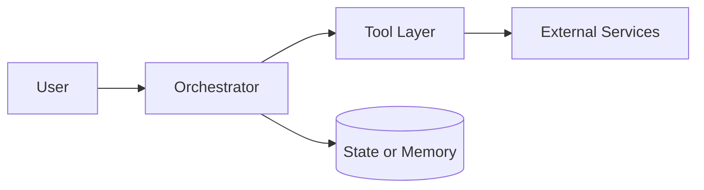
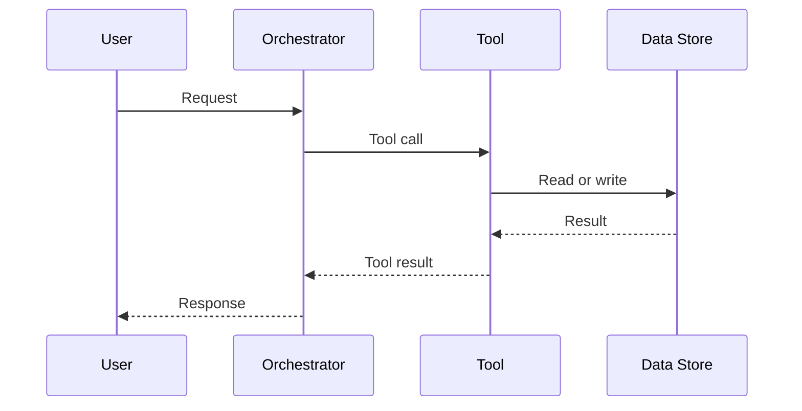
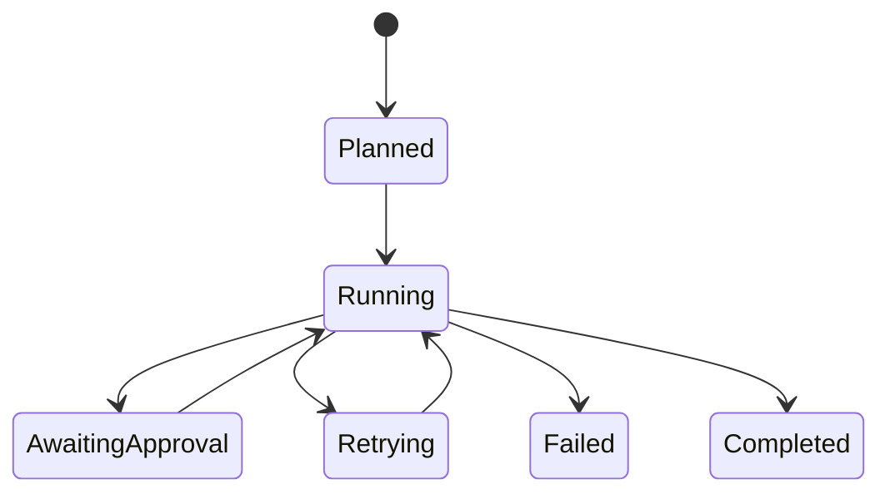
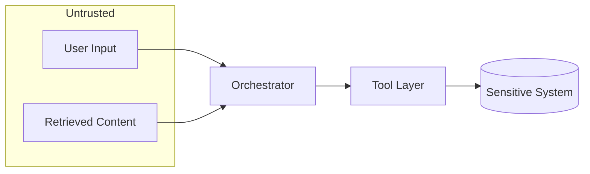
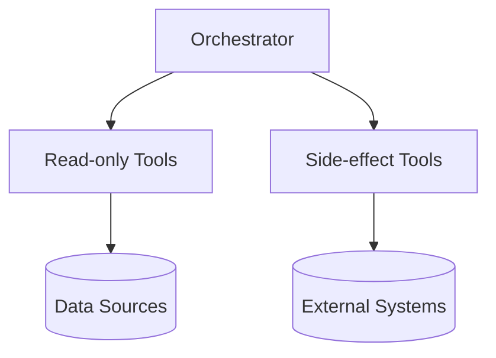

## System Overview

```mermaid
flowchart LR
  User[User] --> Orch[Orchestrator]
  Orch --> Tools[Tool Layer]
  Orch --> State[(State or Memory)]
  Tools --> External[External Services]
```

## Sequence

```mermaid
sequenceDiagram
  participant U as User
  participant O as Orchestrator
  participant T as Tool
  participant D as Data Store
  U->>O: Request
  O->>T: Tool call
  T->>D: Read or write
  D-->>T: Result
  T-->>O: Tool result
  O-->>U: Response
```

## State Or Lifecycle

```mermaid
stateDiagram-v2
  [*] --> Planned
  Planned --> Running
  Running --> AwaitingApproval
  AwaitingApproval --> Running
  Running --> Retrying
  Retrying --> Running
  Running --> Failed
  Running --> Completed
```

## Data-Flow And Trust-Boundary

```mermaid
flowchart LR
  U[User Input] --> O[Orchestrator]
  R[Retrieved Content] --> O
  O --> T[Tool Layer]
  T --> S[(Sensitive System)]
  subgraph Untrusted
    U
    R
  end
```

## Tool Topology

```mermaid
flowchart TB
  O[Orchestrator]
  O --> RO[Read-only Tools]
  O --> RW[Side-effect Tools]
  RO --> DS[(Data Sources)]
  RW --> ES[(External Systems)]
```
